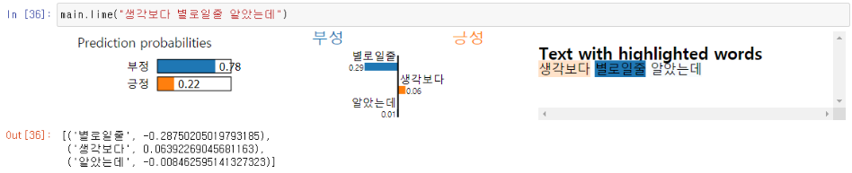

### 깃 목표: 

    1. 모든 NLP 관련 Task를 pipline처럼 통일 시켜 활용이 쉽도록 한다.
    2. 누구나 준수한 성능의 모델 생성이 가능하도록 한다.    

#### 활용 예시 (Bert Classification)

    import sys
    import numpy as np
    import pandas as pd
    sys.path.append("./utils/")
    import Main as mm
    import Post_analysis as pa
    
    # 데이터 로드
    data = pd.read_csv("./data/movie_data.csv")
    
    # 모델 인스턴스 생성
    main = mm.learning()
    
    # 데이터 전처리
    main.preprocess(data, input_col='document',version="bert")
    
    # bert 모델 로드
    main.select_model(selected_model="Bert_classification")
    
    # 모델 학습
    main.fit(test_ratio=0.1, batch_size=512, EPOCHS=1)
    
    # 모델 예측
    main.predict(" 그 모델은 별로다")
    
    main.predict(["그 모델은 별로다"], ["어구어구 어구구"])
    
    # 모델 사후 분석
    
     # 라임 분석
     main.lime(" 그 모델은 별로다")
     
     # binary classification 분석
     import Post_analysis as pa
     pred = main.predict(data["document"])
     pa.report(pred=pred,labels= data["label"])
    
    
    # 모델 저장
    main.save("./save_model")

    # 모델 로드
    main.load("./save_model")

## git 구성 

    0. Sample Data 구성
        1.1 데이터 종류 및 위치 설명
        
    1. 리뷰 분석 (구현 예정)
        1.1 현 데이터 셋 EDA
    
    2. 전처리 (형태소 분석기) 모듈 생성
    
        2.1 음절
        2.2 자소
        2.3 자소 (초, 중, 종 맞추어)
        2.4 n-gram Tokenizer
        2.5 OKT Tokenizer
        2.6 Khaiii
        2.7 Bert Tokenizer
    
    3. Pipline을 활용한 모델 학습, 예측, 저장, and 로드 
        3.1 학습
        3.2 예측
        3.3 저장, 로드
        
        3.4 내장된 모델 종류 
            3.4.1. Charater CNN Classification 설명
            3.4.2. Text CNN Classification 설명
            3.4.3. bert classification 설명
        
    4. 사후분석 pipline 추가
        4.1 Lime 텍스트 분석 
        ### 4.2 Reveiw Complexity 분석(will be)
        4.3 일반적인 binary classification report
        

### 0. Sample 데이터 설명 
    1. Naver 영화 긍/부정 데이터 (./data/movie_data.csv)
    2. 쇼핑몰 리뷰 데이터 (./data/Review.csv)
    3. 크롤링 예시 (./data/Product_DB.csv)
    4. 긍/부정 단어 데이터 (will be) 

### 2. 전처리 모듈 생성

    모듈 설명

        1. 음절 단위의 형태소 분석기
        2. 자소 단위의 형태소 분석기
        3. N-gram 기반의 형태소 분석시
    

    전처리 모듈 사용 예시
    
        # 모듈 임포트
        import sys
        sys.path.append("./utils/")
        import text_preprocess as wk
        
        # 샘플 데이터 로드 
        data = pd.read_csv("./data/movie_data.csv")
        
            # Input Data 예시
                ['폴리스스토리 시리즈는 1부터 뉴까지 버릴께 하나도 없음.. 최고.',
                '와.. 연기가 진짜 개쩔구나.. 지루할거라고 생각했는데 몰입해서 봤다.. 그래 이런게 진짜 영화지']
        
        # 음절 단위로 형태소 분석
        wk.sent2syllable(data['document'])
        
            # 결과 예시 
            [['폴',  '리',  '스',  '스',  '토',  '리', ...] ['와',  '.',  '.',  ' ',  '연',  ... ]]
        
        # 자소 단위로 형태소 분석
        wk.sent2char(data['document'])
        
            # 결과 예시 
            [['ㅍ',  'ㅗ',  'ㄹ',  'ㄹ',  'ㅣ',  'ㅅ',  'ㅡ',  ...] ['ㅇ',  'ㅘ',  '.',  '.',  '.',  ... ]]
            
        # 자소를 초성 중성 종성에 맞추어 형태소 분석
        wk.sent2char3(data['document'])
        
            # 결과 예시 
            [['ㅍ',  'ㅗ',  'ㄹ',  'ㄹ',  'ㅣ',  '_',  'ㅅ',  'ㅡ',  '_',  'ㅅ',  'ㅡ',  '_',  'ㅌ',  'ㅗ',  ...] 
            ['ㅇ',  'ㅘ',  '_',  '.',  '.',  '.',  '.',  '.',  '.',  ' ',  ' ',  ' ',  'ㅇ', ... ]]
            
        # n-gram 기반의 Tokenizer 생성
        post_data, tokenizer, cohesion_score =  wk.tokenizer_c(data['document'], min_count=50, score=0 )
        
            # 결과 예시 
            ['폴리스스토리', '시리즈', '는', '1부터', '뉴까지', '버릴께', '하나도', '없음..', '최고', '.'],
            ['와..',  '연기',  '가',  '진짜',  '개쩔구나..',  '지루',  '할거라고',  '생각', ... ]]
            
        # n-gram Tokenizer 재 사용 예시
        [tokenizer.tokenize(str(doc)) for doc in data['document']]
        
        # Khaiii Tokenizer
        wk.sent2khaiii(data['document'], tag=False)
            
        # otk Tokenizer 생성
        wk.sent2okt(data['document'], tag="noun")
        
            
### 3. Pipline을 활용 

#### 3.1 모델 학습
    import re
    import os
    import sys
    import numpy as np
    import pandas as pd
    sys.path.append("./utils/")
    import text_preprocess as wk
    import Main as mm
    
    
    #load Sameple Data
    data = pd.read_csv("./data/movie_data.csv")
    
    # Text CNN (음절 기반) 학습
    main = mm.learning()
    main.preprocess(data,input_col='document',version="syllable")
    main.select_model(selected_model="TextCnn_syllable")
    main.fit(test_ratio = 0.1, batch_size = 512, EPOCHS = 1)
    
    >>> 에포크: 1, 손실: 0.5619530081748962, 정확도: 69.6661148071289, 테스트 손실: 0.4752803444862366, 테스트 정확도: 76.63999938964844
    
    # Text CNN (자소 기반) 학습
    main = mm.learning()
    main.preprocess(data,input_col='document',version="char")
    main.select_model(selected_model="TextCnn_char")
    main.fit(test_ratio = 0.1, batch_size = 512, EPOCHS = 1)

    >>> 에포크: 1, 손실: 0.5624064803123474, 정확도: 69.78388977050781, 테스트 손실: 0.4794277548789978, 테스트 정확도: 76.72000122070312
    

#### 3.2 모델 예측

    main.predict(data.document)
    >>> array([[0.4868274 , 0.51317257],
               [0.48640245, 0.51359755],
               [0.4866001 , 0.51339996],
               ...,
               [0.48660752, 0.51339245],
               [0.48669702, 0.513303  ],
               [0.48778102, 0.51221895]], dtype=float32)

    main.predict("역대급 최악의 영화")
    >>>  array([[0.80866766, 0.19133233]], dtype=float32)
    
#### 3.3 모델 저장 & 로드
    # 저장
    main.save("/data3/home/wonkyung.sung/Text_minning_VOC/tmp/")
    
    # 로드
    main = mm.learning()
    main.load("/data3/home/wonkyung.sung/Text_minning_VOC/tmp/")

### 4. 사후 분석
#### 4.1 lime 분석
    main.lime("생각보다 별로일줄 알았는데")
    

#### 4.2 binary classification report
    import Post_analysis as pa
    pred = main.predict(data["document"])
    pa.report(pred=pred,labels= data["label"])
    >>>
                      precision    recall  f1-score   support
                   1       1.00      1.00      1.00      1001
            accuracy                           1.00      1001
           macro avg       1.00      1.00      1.00      1001
        weighted avg       1.00      1.00      1.00      1001
    
    
